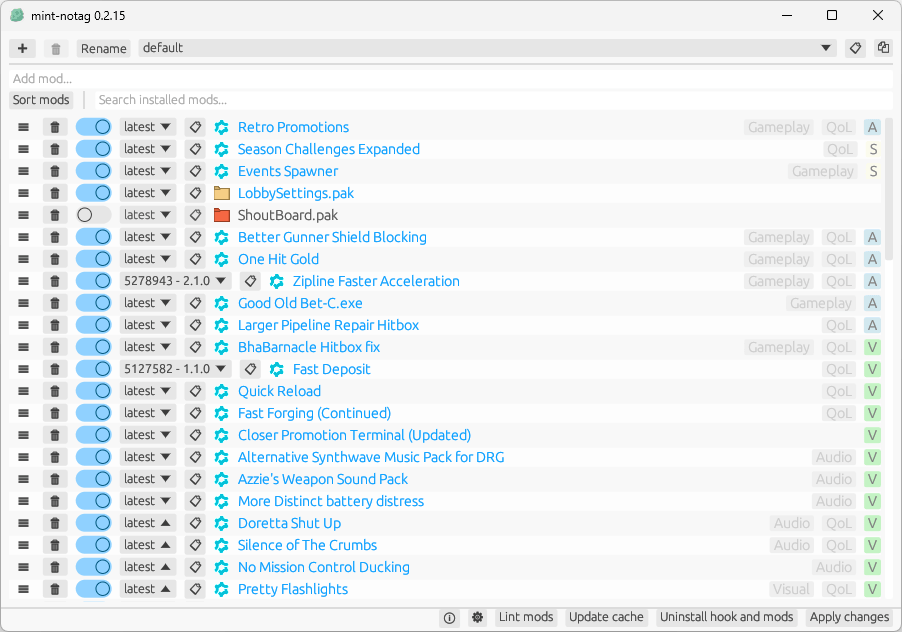

<!-- markdownlint-disable MD033 MD041 -->

<div align="center">
  
</div>

<div align="center">
  <strong>mint-notag</strong>
</div>

<p align="center">
  <em>Third-party mod integration tool for Deep Rock Galactic.</em>
</p>

## About

This is my fork of mint with the following changes from [upstream](https://github.com/trumank/mint/tree/832f7db9587e99ca1c74eb25902ff0ca7e0cb460):

- The `[MODDED]` prefix is omitted from public lobby name
- Renamed program to `mint-notag` from `DRG Mod Integration` / `mint`
  - Logs and config paths will still use the old name
- Added a confirmation dialog before deleting a mod
- Added a sort button
  - This will sort mods by Enabled status, Provider, then by Name
- Made search bar always visible
- Added an [icon](../assets/icon.ico) to title bar, taskbar and executable
- Changed main window size and position
- Shortened approval labels
- Improved messages and buttons description
- Added <kbd>CTRL</kbd> + <kbd>Q</kbd> keyboard shortcut to quit the program
- Improved update modal
  - Added Download button that will open the latest release page
  - Close button can be pressed immediately
  - Fetch remote images in the release notes

For more information on mint usage see the [official User Guide](https://jieyouxu.github.io/drg-modding-docs/mint/getting-started.html).

## Preview



## Download

The latest release is available on the [Releases page](https://github.com/Strappazzon/drg-mint-notag/releases/latest).

> [!NOTE]
> This fork is tested on Windows and the Steam version of the game.

### Linux Support

To launch the program on Linux distros, use the following commands:

```sh
export LD_LIBRARY_PATH=~/opt/lib:$LD_LIBRARY_PATH
env -u WAYLAND_DISPLAY ./drg_mod_integration

# Credits to https://github.com/trumank/mint/issues/299#issuecomment-3401198284
```

## Contributing

If you are interested in contributing directly to this repository, please see:

- [Contribution Guidelines](./CONTRIBUTING.md)
- [Code of Conduct](https://github.com/Strappazzon/.github/blob/-/CODE_OF_CONDUCT.md)

## Licensing

The code is open source under the terms of the [MIT License](../LICENSE.txt).

App icon from [Icons8](https://icons8.com/icon/6zZTdWRZoWil/rock).

By contributing to this repository, you agree that the content you contribute may be provided under the terms of the [MIT License](../LICENSE.txt).
