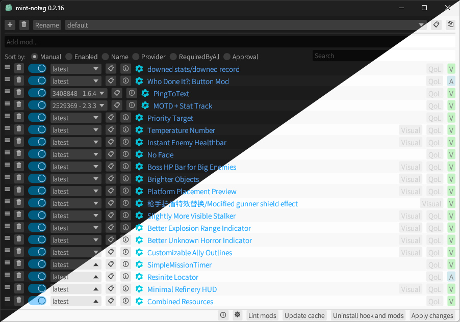

<!-- markdownlint-disable MD033 MD041 -->

<div align="center">
  
</div>

<div align="center">
  <strong>mint-notag</strong>
</div>

<p align="center">
  <em>Third-party mod integration tool for Deep Rock Galactic.</em>
</p>

## About

This a fork of mint with some modifications.

Changes or merges since [upstream/master @ 940e7aa](https://github.com/trumank/mint/tree/940e7aaf960dc4280fc0442a6c7f87afec440c0c):

- Omitted the `[MODDED]` prefix from the public server name
- Load priority
  - In case of asset conflict, mods with higher priority take precedence
- Changed app title to `mint-notag` from `mint`
- Confirmation dialog when deleting a mod or profile
- Sorting options for mods
- Search bar always visible
- Time since last action
- Detailed mod info view
  - Click the info button beside the mod name to see the its description, changelog and download the latest pak
- Note taking feature
  - Click the note button beside the mod name to add a comment
  - An excerpt of the note will be shown next to the mod name
- App [icon](../assets/icon.ico) in the title bar, taskbar and Windows executable
- Bigger window size
- Centered main window at launch
- Shorter [Approval labels](https://mod.io/g/drg/r/mod-guidelines-and-status-categories#heading-3)
- <kbd>CTRL</kbd> + <kbd>Q</kbd> keyboard shortcut to quit the program
- Support for mod.io new URL format
- pak bundle will be compressed
- Renamed config and cache directories from `drg-mod-integration` to `mint`
  - Will default to legacy directories if they exist

Known issues:

- Oodle compression is not available on Linux (upstream)

For more information on mint usage see the [official User Guide](https://jieyouxu.github.io/drg-modding-docs/mint/getting-started.html).

## Preview



## Download

The latest release is available on the [Releases page](https://github.com/Strappazzon/drg-mint-notag/releases/latest).

### Compatibility

This fork is tested on Windows 11 and the Steam version of the game, but it *should* work on the Microsoft Store version of DRG as well.

Running on macOS is *not* supported.

### Linux Support

To launch the program on Linux distros, use the following commands:

```sh
export LD_LIBRARY_PATH=~/opt/lib:$LD_LIBRARY_PATH
env -u WAYLAND_DISPLAY ./mint

# Credits to https://github.com/trumank/mint/issues/299#issuecomment-3401198284
```

## Contributing

If you are interested in contributing directly to this repository, please see:

- [Contribution Guidelines](./CONTRIBUTING.md)
- [Code of Conduct](https://github.com/Strappazzon/.github/blob/-/CODE_OF_CONDUCT.md)

## Licensing

The code is open source under the terms of the [MIT License](../LICENSE.txt).

App icon "Rock" from [Icons8](https://icons8.com/icon/6zZTdWRZoWil/rock).

By contributing to this repository, you agree that the content you contribute may be provided under the terms of the [MIT License](../LICENSE.txt).
