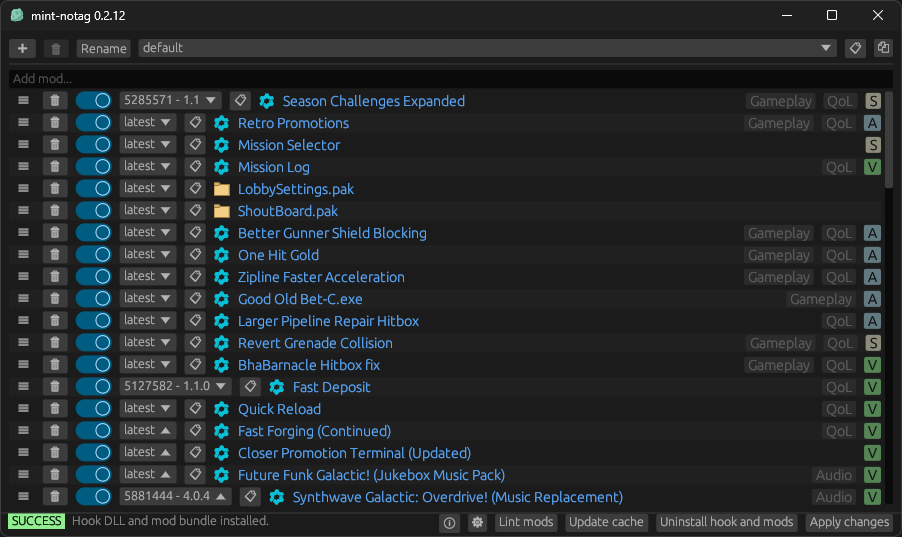

<!-- markdownlint-disable MD033 -->

# mint-notag

This is my fork of mint with the following changes from [upstream](https://github.com/trumank/mint/tree/832f7db):

- Omit `[MODDED]` prefix from public lobby name
- Renamed program to `mint-notag` from `DRG Mod Integration`
  - Logs and config paths will still use the old name
- Added an [icon](../assets/icon.ico) to title bar, taskbar and executable
- Changed main window size and position
- Improved messages and buttons description
- Improved update modal
  - Added Download button that will open the release page
  - Close button can be closed immediately
  - Fetch remote images in the release notes
- Shortened approval labels
- Added <kbd>CTRL</kbd> + <kbd>Q</kbd> keyboard shortcut to quit the program

For more information on mint usage see the [original README](https://github.com/trumank/mint?tab=readme-ov-file).

## Preview

## Download

The latest release is available on the [Releases page](https://github.com/Strappazzon/drg-mint-notag/releases/latest).
